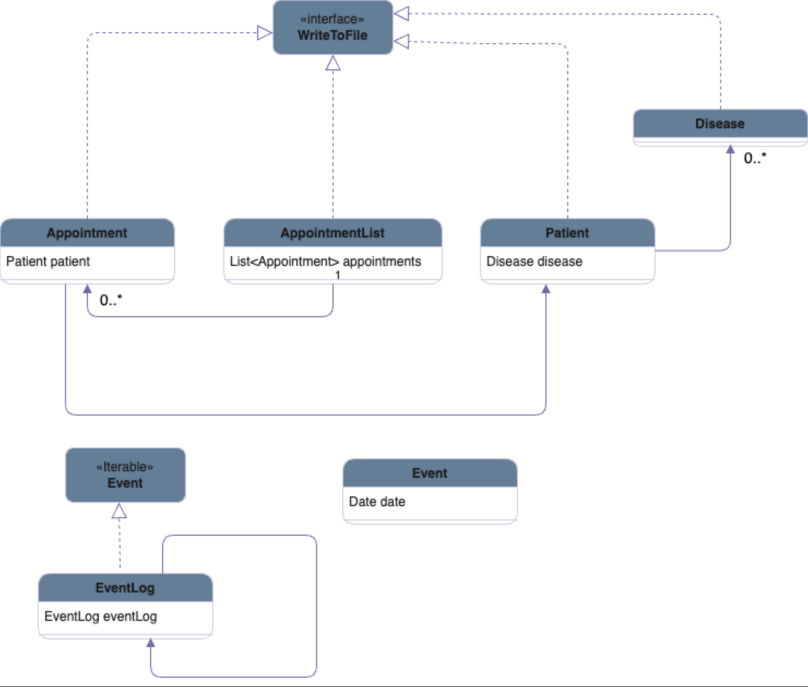

# Healthcare Management System 

## About the Application 

**What is the purpose of the application?** 

- The application will keep track of patient information and show the schedule of appointments for the healthcare facility.
- The healthcare staff members have the capability to make changes to appointments, such as canceling or rescheduling 
 them, through the use of the application. 
- This system is particularly beneficial for healthcare institutions such as hospitals or 
  clinics that have a high patient volume. 

**Who will use it?**
- This application can be utilized by various healthcare providers, 
  such as small clinics or any other firms that require appointment-based scheduling.

**Why is this project of interest to you?**

- As someone who has always been interested in creating tools to assist those in the healthcare industry, 
I am particularly drawn to this project. My goal is to develop an application that can make the job of doctors, 
specifically my father, more manageable.
In the fast-paced world of medicine, doctors often have to deal with a huge amount of information, patient data, and paperwork. 

- This can make their job stressful and time-consuming, leading to burnout and decreased patient care. 
By developing a tool that can assist doctors and make their job more manageable, I hope to have a positive impact on the 
quality of healthcare they provide.

- The healthcare industry is ripe for innovation, and there are many areas where technology can play a supportive role. 
Electronic medical records, telemedicine, and medical decision support systems are just a few examples. 
I believe that by utilizing the latest technology and advancements in artificial intelligence, 
I can create an application that will truly make a difference in the lives of doctors and their patients.
I am confident that this project will not only make a meaningful contribution to the field of healthcare, 
but also bring me one step closer to realizing my goal of creating tools that can improve the lives of those in the 
medical community.

## User Stories

**As a user, I will have the capability to:**

- Add patient details
- Schedule a new appointment and add it to the existing list
- Change the date and time of an existing appointment to the another day
- Remove an appointment that has been scheduled
- Search the appointment details using the patient's Personal Health Number (PHN)
- Display all the appointments for a given date
- Save the entire state of Patients and Appointments to the file 
- Load the saved state of Patients and Appointments from the last time it was run 
  and resume where it was left off

## Instructions for Grader 
- You can generate the first required action by adding a patient to the Patients List and by adding an appointment to 
  the appointment list.
- You can generate the second required action by cancelling the appointment based on the patient's personal health number. 
- You can generate the third required action by displaying the patient's appointment details based on the patient's 
  personal health number. 
- You can locate my visual component by seeing different pop-ups at different places when running the application. 
- You can save the state of my application by giving confirmation in different pop-up dialogues at different points 
  in time when running the application.
- You can reload the state of my application by pressing the "Load data" button in the menu. 
It will display a confirmation message upon loading data successfully. 

## Phase 4: Task 2
- Thu Mar 30 21:55:55 PDT 2023
- Patients Saved to ./data/patients.json
- Thu Mar 30 21:56:10 PDT 2023
- Retrieved Appointment Details For PHN: 898989
- Thu Mar 30 21:56:10 PDT 2023
- Appointment Added
- Thu Mar 30 21:56:15 PDT 2023
- Saved appointments to ./data/Appointments.json
- Thu Mar 30 21:56:29 PDT 2023
- Appointment Cancelled
- Thu Mar 30 21:56:32 PDT 2023
- Saved appointments to ./data/Appointments.json
- Process finished with exit code 69`

## UML Class Diagram 

## References

- The graphical user interface (GUI) of the application was derived from various sources found on
  [stackoverflow.com](https://stackoverflow.com/). 