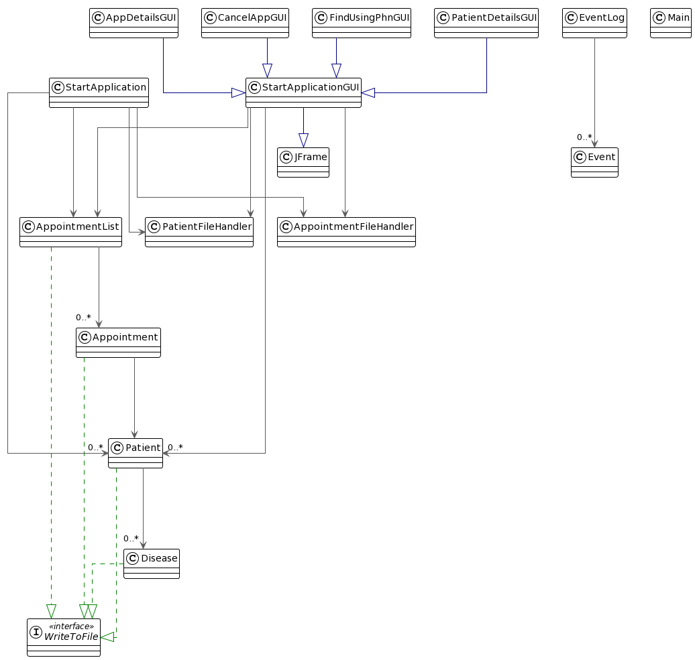

# Healthcare Management System 

## About the Application 

**What is the purpose of the application?** 

- The application will keep track of patient information and show the schedule of appointments for the healthcare facility.
- The healthcare staff members have the capability to make changes to appointments, such as canceling or rescheduling 
 them, through the use of the application. 
- This system is particularly beneficial for healthcare institutions such as hospitals or 
  clinics that have a high patient volume. 

**Who will use it?**
- This application can be utilized by various healthcare providers, 
  such as small clinics or any other firms that require appointment-based scheduling.

## User Stories

**As a user, I will have the capability to:**

- Add patient details
- Schedule a new appointment and add it to the existing list
- Change the date and time of an existing appointment to the another day
- Remove an appointment that has been scheduled
- Search the appointment details using the patient's Personal Health Number (PHN)
- Display all the appointments for a given date
- Save the entire state of Patients and Appointments to the file 
- Load the saved state of Patients and Appointments from the last time it was run 
  and resume where it was left off

## Sample Logging of Events
~~~
  Sun Apr 09 18:42:57 PDT 2023 
  Retrieved Appointment Details For PHN: 595961
  Sun Apr 09 18:43:41 PDT 2023 
  Failed to retrieve appointment details for PHN: 696969
  Sun Apr 09 18:43:41 PDT 2023 
  Appointment Added for PHN: 696969
  Sun Apr 09 18:43:52 PDT 2023 
  Retrieved Appointment Details For PHN: 696969
  Sun Apr 09 18:44:02 PDT 2023 
  Retrieved Appointment Details For PHN: 696969
  Sun Apr 09 18:44:02 PDT 2023 
  Appointment Cancelled for PHN: 696969
  Sun Apr 09 18:44:12 PDT 2023 
  Failed to retrieve appointment details for PHN: 696969
~~~

## How can this project be improved? 
I think there are several ways in which the cohesion can be increased and coupling can be reduced.

1. In order to reduce coupling, I am planning to break the console-based UI into multiple classes. This way, each class 
   will have access to only the necessary information, and the overall design will become more modular and easier 
   to maintain. With this approach, I can ensure that the UI components are loosely coupled, and changes in one 
   component will not affect the others.

2. I have realized that the current type of relationships between the components of my GUI is leading to the creation 
   of multiple instances of the super class, which is taking more memory. To address this, I plan to incorporate 
   the Singleton Design Pattern. By doing so, I will ensure that there is only one instance of the main window 
   throughout the application, and this will significantly reduce the memory usage. Moreover, 
   this design pattern will also ensure that the state of the window remains consistent across all the components.

3. If I had more time, I would revisit the relationships between the classes in my graphical user interface. 
   Currently, these relationships violate the Liskov substitution principle. Rather than having these classes extend
   the main class, I would instead keep a private field of StartApplicationGUI in the classes that currently extend it. 
   This would allow me to improve the design and ensure that all subclasses can be used interchangeably with the 
   superclass without introducing unexpected behavior.

4. I also realized that I can incorporate the iterator design pattern in the AppointmentList class as it holds 
   a collection of appointments. If I implemented the iterator pattern, it would prevent calls to getAppointments() 
   method, which would consume less memory and make program more efficient. Also, this would give me freedom to choose 
   any type of suitable collection data structure (LinkedHashSet or HashSet) without breaking the code.

## UML Class Diagram 

## References

- The graphical user interface (GUI) of the application was derived from various sources found on
  [stackoverflow.com](https://stackoverflow.com/). 
